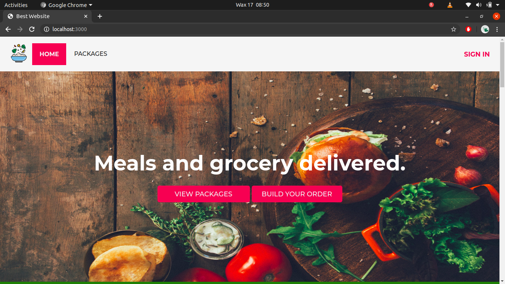

# Meal Delivery Website

## Introduction

A website built to gain experience in building
Dynamic websites and Server-Side Web applications using Node.js and Express.

Inspired by the [Live Fit Food website](https://livefitfood.ca).



## Development

- All back-end functionality built with NodeJS and Express.
- All views created with Express-Handlebars.
- No Front-End CSS or JavaScript Frameworks used.

## How to run

```
$ yarn
$ yarn start
```

Then visit `localhost:3000`

## Gallery

</img> </img> </img> </img> </img> </img>
